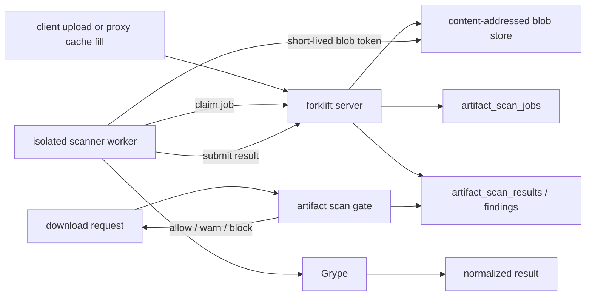

# Artifact scanning

## Overview

Artifact scanning checks the bytes forklift stores in its blob store. It is
separate from the coordinate-level OSV vulnerability scan and deps.dev license
resolution:

- OSV/deps.dev answer "what is known about this package coordinate?"
- Artifact scanning answers "what did the scanner find inside this exact
  downloaded or uploaded blob?"

The feature is optional. When enabled, forklift enqueues stored blobs for scan,
stores normalized results, shows them in the artifact browser, and can gate
downloads by the latest result. Archive parsing and scanner execution stay out
of the main server process.

## Architecture



The server owns:

- job creation when an artifact is cached or uploaded;
- worker authentication and short-lived per-job blob tokens;
- result persistence;
- per-repository policy evaluation during GET/HEAD requests.

The worker owns:

- claiming one job at a time;
- downloading the blob into an `emptyDir` workspace;
- running Grype through the scanner driver;
- parsing scanner output into forklift's normalized result model;
- deleting the workspace before the next job.

## Why a separate worker

Scanner and archive parsers are intentionally treated as untrusted code paths.
If a crafted archive exploits the scanner, the compromise should be contained
inside a disposable worker environment, not the repository server that owns
auth, metadata, and package serving.

The Helm worker deployment hardens that boundary:

- `runAsNonRoot` UID/GID 65532;
- `readOnlyRootFilesystem`;
- all Linux capabilities dropped;
- `seccompProfile: RuntimeDefault`;
- no Kubernetes service-account token mount;
- bounded `emptyDir` workspace;
- optional `runtimeClassName` for gVisor/Kata;
- NetworkPolicy limiting scanner egress to forklift when supported by the CNI.

## Enabling

Server-side job APIs and enqueue hooks:

```bash
FORKLIFT_ARTIFACT_SCAN_ENABLED=true
FORKLIFT_ARTIFACT_SCAN_SCANNER=grype
FORKLIFT_ARTIFACT_SCAN_WORKER_TOKEN=<shared-worker-token>
```

Equivalent Helm values:

```yaml
artifactScanning:
  enabled: true
  scanner: grype
  worker:
    enabled: true
    replicas: 2
    runtimeClassName: gvisor
```

The chart generates and preserves `artifact-scan-worker-token` when
`artifactScanning.workerToken` is empty. `artifactScanning.tokenKey` can provide
a distinct HMAC key for per-job blob tokens; otherwise the server reuses the
session secret.

Build the worker image with the Docker target:

```bash
docker build --target scanner-runtime -t ghcr.io/example/forklift-scanner:dev .
```

## Repository policy

Artifact scan enforcement is configured per repository:

```json
{
  "artifact_scan": {
    "enabled": true,
    "scanner": "grype",
    "config_hash": "",
    "threshold": "high",
    "action": "block",
    "block_unscanned": false
  }
}
```

| Field | Meaning |
|-------|---------|
| `enabled` | Turns on the download gate for this repository. |
| `scanner` | Scanner profile name. Defaults to `grype`. |
| `config_hash` | Optional scanner profile identifier; lets multiple scanner configs coexist. |
| `threshold` | `critical`, `high`, `medium`, or `low`. Default `high`. |
| `action` | `block`, `warn`, or `audit`. Default `audit`. |
| `block_unscanned` | With `action=block`, reject artifacts without a completed result. |

The gate is synchronous but never runs a scanner in the request path. It only
looks up the latest stored result for `(blob_sha256, scanner, config_hash)`.

## Worker operation

The bundled worker command is `forklift-scanner`:

```bash
forklift-scanner \
  --server=http://forklift:80 \
  --worker-id=scanner-1 \
  --worker-token="$FORKLIFT_ARTIFACT_SCAN_WORKER_TOKEN" \
  --work-dir=/work \
  --max-artifact-bytes=104857600
```

The worker can run continuously or with `--once` for disposable batch-style
execution. Multiple workers are safe: each job is claimed with a lease, and an
expired lease can be reclaimed by another worker.

## Visibility

`GET /api/v1/repositories/{id}/artifacts` includes:

- `artifact_scan_status`
- `artifact_scan_max_severity`
- `artifact_scan_scanner`
- `artifact_scan_scanned_at`
- `artifact_scan_finding_count`

The UI renders these fields in the repository artifact table.

## Limits

- The first implementation ships a Grype driver. Syft is not required because
  Grype can generate the SBOM internally for supported inputs, but a future
  driver can split Syft SBOM generation from Grype vulnerability matching.
- Results are keyed by blob digest, scanner, and config hash. Changing scanner
  configuration should change `config_hash` so old results do not satisfy the
  new policy.
- This is artifact-byte scanning, not runtime behavior analysis or malware
  sandboxing. Use RuntimeClass isolation and short-lived workers to reduce blast
  radius, then treat scanner findings as one signal in the repository policy.
