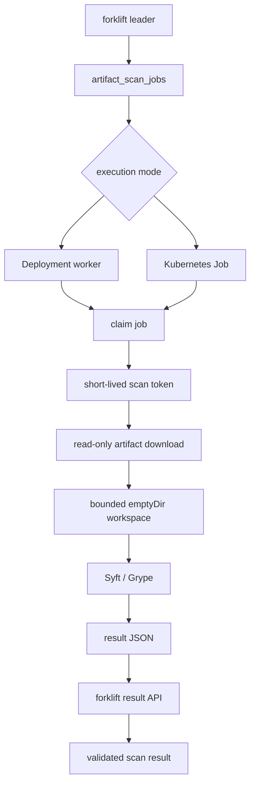

# Artifact Scanner Worker Security Design

## Status

Draft. This document expands the optional artifact scanning design with a
concrete worker and execution-isolation model. The primary assumption is that
scanner tools, archive parsers, and input artifacts are untrusted.

## Problem

Artifact-level scanning requires forklift to inspect bytes supplied by package
publishers or upstream registries. That changes the threat model compared with
the current coordinate-level OSV and deps.dev lookups.

The current forklift model is lightweight and low-risk:

```text
package coordinate -> OSV/deps.dev query -> stored verdict
```

Artifact scanning introduces a higher-risk path:

```text
artifact blob -> archive extraction / package cataloging -> scanner parsing
```

The design goal is not to prove that scanner tools cannot be compromised. The
goal is to make scanner compromise low impact:

```text
scanner compromise affects one scan job, not forklift, SQLite, blob storage, or
the Kubernetes control plane.
```

## Goals

- Keep artifact parsing out of the forklift server process.
- Run scanner tools with least privilege.
- Support disposable one-artifact scan jobs for high-risk repositories.
- Allow gVisor or Kata Containers without requiring them for all deployments.
- Prevent scanner workers from directly accessing SQLite or writable blob
  storage.
- Prevent scanner workers from using Kubernetes API credentials by default.
- Keep network egress narrowly scoped.
- Validate scanner results before storing them.
- Make scanner database freshness visible in results.

## Non-Goals

- Do not build a malware detonation sandbox.
- Do not execute package lifecycle hooks, tests, builds, installers, or user
  code.
- Do not require gVisor, Kata Containers, Kyverno, Gatekeeper, or Falco for
  normal forklift operation.
- Do not make the scanner worker part of forklift's HA leader election.
- Do not let scanner workers write to SQLite or mutate blobs directly.

## Threat Model

The design assumes the following can be malicious or vulnerable:

- Uploaded or proxied artifact bytes.
- Archive structures, including zip bombs, tar path traversal, hardlinks,
  symlinks, device entries, and deeply nested paths.
- Package manifests and metadata.
- Scanner binaries and their transitive dependencies.
- Scanner output JSON.
- Scanner database update endpoints, unless pinned to an internal mirror.

The design protects:

- The forklift server process.
- SQLite metadata.
- Blob storage write path.
- Kubernetes API.
- Other workloads in the cluster.
- Other scan jobs.

## Architecture

```text
forklift server
  - owns scan job state
  - owns blob read authorization
  - owns result validation and persistence
  - owns policy verdicts

scanner worker
  - claims one job or receives one job
  - downloads one artifact with a short-lived token
  - prepares a bounded workspace
  - runs scanner tools
  - submits normalized result
  - exits or waits for another job, depending on mode
```

## Code Boundary

The existing coordinate analyzers should remain in the server process:

```text
internal/vuln      -> OSV coordinate vulnerability lookup
internal/license   -> deps.dev coordinate license lookup
```

Artifact scanning should use a separate code path:

```text
internal/artifactscan
  server-owned job, result, validation, and policy model

internal/scannerworker
  worker-owned workspace, driver, and tool execution model
```

The import direction should preserve the trust boundary:

```text
forklift server may import internal/artifactscan.
scanner worker may import internal/artifactscan.
forklift server must not import internal/scannerworker.
internal/scannerworker must not import internal/meta.
scanner drivers must not live under internal/repo.
```

This keeps the current lightweight coordinate scans intact while allowing
artifact scanners to behave like out-of-process plugins. Avoid Go runtime
plugins (`plugin.Open`); scanner extension should happen by adding worker
drivers or worker images, not by loading untrusted code into the server process.



The first implementation should use an external worker binary or image, not the
forklift server image. The worker may execute Grype directly at first and add
Syft later when SBOM persistence becomes a product requirement.

## Execution Modes

### Deployment Mode

Deployment mode keeps a small pool of workers running.

```text
scanner Deployment
  replicas: 1
  concurrency per replica: 1
```

This is faster and cheaper than creating a Kubernetes Job for every artifact.
It is appropriate for audit-only rollout and trusted internal repositories.

Required controls:

- Restricted pod security context.
- No mounted service account token.
- NetworkPolicy egress allowlist.
- Bounded `emptyDir`.
- CPU, memory, and ephemeral storage limits.
- Per-job workspace cleanup.
- Job lease and heartbeat.

### Job Mode

Job mode creates one Kubernetes Job per scan.

```text
one artifact -> one pod -> one result -> pod deleted
```

This is slower but provides better contamination boundaries. It is appropriate
for public uploads, high-risk repositories, large archives, or strict policy
profiles.

Required controls:

- `backoffLimit: 0` or a low retry count.
- `activeDeadlineSeconds` for scan timeout.
- `ttlSecondsAfterFinished` for cleanup.
- Same security context, network, resource, and token controls as Deployment
  mode.

Recommended default:

```text
MVP: Deployment mode, replicas=1, concurrency=1, audit-only
Hardened profile: Job mode
```

## Runtime Isolation

The scanner runtime should be configurable:

```yaml
artifactScanning:
  worker:
    runtimeClassName: ""       # "", "gvisor", "kata"
```

### Default Runtime

The default runtime is standard Kubernetes container execution with Restricted
pod settings. This keeps the feature deployable on ordinary clusters.

### gVisor

gVisor is a good hardened option for scanner workers. It adds a user-space
kernel boundary between the scanner container and the host kernel. It is heavier
than regular `runc`, especially for filesystem-heavy scans, but artifact
scanning is asynchronous and should not sit on the request path.

Use gVisor for:

- public or semi-trusted uploads
- repositories that accept third-party artifacts
- high-severity enforcement profiles
- large or complex archive formats

### Kata Containers

Kata provides a stronger VM-like isolation boundary. It is more expensive than
gVisor and should be treated as a high-security profile rather than a default.

Use Kata for:

- strict tenant isolation
- regulated environments
- clusters where scanner compromise must be isolated from the node kernel

## Pod Security Baseline

Worker pods should satisfy the Kubernetes Restricted profile.

```yaml
automountServiceAccountToken: false

securityContext:
  runAsNonRoot: true
  runAsUser: 65532
  runAsGroup: 65532
  fsGroup: 65532
  seccompProfile:
    type: RuntimeDefault

containers:
  - name: scanner
    securityContext:
      allowPrivilegeEscalation: false
      readOnlyRootFilesystem: true
      capabilities:
        drop: ["ALL"]
```

The scanner container must not use:

- `privileged: true`
- `hostNetwork: true`
- `hostPID: true`
- `hostIPC: true`
- `hostPath` volumes
- Docker socket mounts
- writable root filesystem
- broad service account permissions

## Filesystem Layout

The worker filesystem should separate immutable input, mutable workspace, and
output:

```text
/input
  artifact blob or prepared artifact
  read-only after download

/work
  extraction and scanner temporary files
  emptyDir with sizeLimit

/output
  scanner output JSON
  emptyDir with sizeLimit
```

Example limits:

```yaml
resources:
  requests:
    cpu: 100m
    memory: 256Mi
    ephemeral-storage: 512Mi
  limits:
    cpu: "1"
    memory: 1Gi
    ephemeral-storage: 2Gi

volumes:
  - name: work
    emptyDir:
      sizeLimit: 2Gi
  - name: output
    emptyDir:
      sizeLimit: 128Mi
```

Artifact preparation must enforce:

- maximum compressed size
- maximum extracted size
- maximum file count
- maximum path depth
- maximum individual file size
- timeout
- no absolute paths
- no `..` traversal
- no device files
- no FIFOs or sockets
- symlink and hardlink rejection or safe dereference policy

The worker must never run package lifecycle commands such as:

- `npm install`
- `pip install`
- `mvn test`
- `go test`
- `cargo build`
- package post-install hooks

## Network Isolation

Scanner workers should start from egress deny and allow only required
destinations.

Allowed by default:

- forklift internal API
- DNS, only if service discovery requires it

Optional:

- internal Grype DB mirror
- internal proxy for scanner database updates

Forbidden by default:

- Kubernetes API
- cloud instance metadata service
- arbitrary internet egress
- database endpoints
- blob storage write endpoints
- unrelated cluster services

Example egress allowlist:

```yaml
apiVersion: networking.k8s.io/v1
kind: NetworkPolicy
metadata:
  name: forklift-scanner-egress
spec:
  podSelector:
    matchLabels:
      app.kubernetes.io/name: forklift
      app.kubernetes.io/component: scanner
  policyTypes: ["Egress"]
  egress:
    - to:
        - podSelector:
            matchLabels:
              app.kubernetes.io/name: forklift
      ports:
        - protocol: TCP
          port: 8080
```

If Grype database updates are enabled, prefer an internal mirror over direct
internet access.

## Capability Token

Workers should not use normal user tokens or admin tokens. Each scan job should
receive a short-lived capability token.

Token claims:

```text
audience: scanner
job_id: <scan job id>
blob_sha256: <artifact blob>
permissions:
  - read_scan_blob
  - submit_scan_result
expires_at: now + 10-30 minutes
one_time_result_submit: true
```

Allowed API calls:

```http
GET  /internal/scans/{job_id}/blob
POST /internal/scans/{job_id}/result
POST /internal/scans/{job_id}/heartbeat
```

The server must reject:

- token used for another job
- token used for another blob SHA-256
- expired token
- duplicate final result submission
- stale worker submission after lease loss
- result larger than configured maximum
- invalid result schema

## Worker API Contract

Deployment mode:

```http
POST /internal/scans/claim
```

Response:

```json
{
  "job_id": "123",
  "blob_sha256": "abc...",
  "scanner": "grype",
  "token": "short-lived-token",
  "deadline": "2026-07-01T12:00:00Z",
  "limits": {
    "max_artifact_bytes": 104857600,
    "max_extracted_bytes": 2147483648,
    "max_files": 100000
  }
}
```

Job mode can skip claim and receive the same payload through environment or a
mounted job spec secret created by the leader.

Result submission:

```http
POST /internal/scans/{job_id}/result
```

Minimum result fields:

```text
job_id
blob_sha256
scanner
scanner_version
database_schema_version
database_built_at
database_providers
status              completed | failed | not_applicable | skipped_too_large
max_severity
findings[]
raw_result_digest
```

The server should persist normalized findings and keep raw scanner output
optional. If raw output is stored, cap its size and treat it as untrusted data.

## Grype Execution

Initial Grype-only execution:

```bash
GRYPE_DB_AUTO_UPDATE=false \
GRYPE_CHECK_FOR_APP_UPDATE=false \
grype dir:/work/input -o json > /output/grype.json
```

Later Syft plus Grype execution:

```bash
syft dir:/work/input -o cyclonedx-json > /output/sbom.json
grype sbom:/output/sbom.json -o json > /output/grype.json
```

Recommended operational stance:

- Disable scanner DB updates during scan execution.
- Preload the DB in the scanner image, or sync it from an internal mirror.
- Validate DB age before scanning.
- Store DB built time and provider provenance in scan results.
- Alert when DB freshness exceeds policy.

## Queue and Lease Semantics

forklift owns the queue. Workers must not write job state directly in SQLite.

States:

```text
queued
running
completed
failed
not_applicable
skipped_too_large
dead
reused
```

Required fields:

```text
worker_id
lease_until
attempts
next_run_at
last_heartbeat_at
started_at
finished_at
```

Semantics:

- Claim is atomic and leader-owned.
- Workers heartbeat while running.
- Expired leases return to `queued` or `dead` depending on attempt count.
- Result submission is idempotent for the winning lease.
- Stale workers receive a conflict response and must exit.
- The system is at-least-once; result writes must be deduplicated.

Dedup key:

```text
blob_sha256 + scanner + scanner_version + database_built_at + scanner_config_hash
```

## Result Trust Boundary

Scanner output is not trusted just because it came from the worker.

Server-side validation must enforce:

- JSON schema.
- maximum finding count.
- maximum string lengths.
- valid severity enum.
- valid package type enum where possible.
- valid URL length and scheme.
- `blob_sha256` equals the job blob.
- scanner identity equals the job scanner.
- database freshness fields are present.
- duplicate findings are collapsed.

Policy decisions should use normalized fields only. UI rendering must escape all
scanner-supplied strings.

## Helm Values Shape

```yaml
artifactScanning:
  enabled: false

  worker:
    enabled: false
    mode: deployment              # deployment | job
    replicas: 1
    concurrency: 1
    runtimeClassName: ""          # "", "gvisor", "kata"
    activeDeadlineSeconds: 600
    ttlSecondsAfterFinished: 300

    image:
      repository: ghcr.io/opencomputinggarage/forklift-scanner
      tag: ""

    securityContext:
      restricted: true
      runAsUser: 65532
      runAsGroup: 65532
      fsGroup: 65532

    resources:
      requests:
        cpu: 100m
        memory: 256Mi
        ephemeral-storage: 512Mi
      limits:
        cpu: "1"
        memory: 1Gi
        ephemeral-storage: 2Gi

    workspace:
      maxArtifactBytes: 104857600
      maxExtractedBytes: 2147483648
      maxFiles: 100000
      emptyDirSizeLimit: 2Gi

    networkPolicy:
      enabled: true
      allowDns: true
      allowExternalDbUpdate: false

  grype:
    autoUpdateDb: false
    validateDbAge: true
    maxDbAge: 120h

  policy:
    action: audit
    threshold: high
    blockUnscanned: false
```

## Optional Cluster Policy

Clusters that already use Kyverno or OPA Gatekeeper can enforce scanner pod
guardrails:

- require `runAsNonRoot`
- require `allowPrivilegeEscalation=false`
- require `readOnlyRootFilesystem=true`
- require `capabilities.drop=["ALL"]`
- forbid `hostPath`
- forbid host namespaces
- require resource limits
- require `automountServiceAccountToken=false`
- restrict `runtimeClassName` to approved values

Falco or similar runtime detection can be used to alert on unexpected scanner
behavior, but detection is not a substitute for isolation.

## Rollout

### Phase 1: Safe Extension Point

- Add job/result API contract.
- Add no scanner binaries to the forklift server image.
- Add schema validation for result submission.
- Add audit-only policy surface.

### Phase 2: Restricted Deployment Worker

- Add Grype-only worker image.
- Run Deployment mode with `replicas=1`, `concurrency=1`.
- Disable DB auto-update during scan.
- Add NetworkPolicy and Restricted security context.
- Store scanner version and DB freshness.

### Phase 3: Job Mode

- Add one-shot Kubernetes Job execution.
- Enable per-repository scanner profile selection.
- Use Job mode for high-risk repositories.

### Phase 4: RuntimeClass Hardening

- Add `runtimeClassName` support for gVisor and Kata.
- Document expected overhead.
- Keep standard runtime as the compatibility default.

### Phase 5: SBOM and License Extensions

- Add Syft only when SBOM persistence is needed.
- Add Grant only when SBOM-based license policy is needed.
- Keep Dependency-Track optional.

## Current Recommendation

Start with a Grype-only isolated worker and audit-only policy. Use Deployment
mode for the first implementation, but design the API so Job mode can be added
without changing result storage. Make `runtimeClassName` configurable from the
start, with an empty default and documented `gvisor` and `kata` profiles.

The server should remain a registry and policy engine. The scanner worker should
be the only component that handles untrusted artifact bytes.
