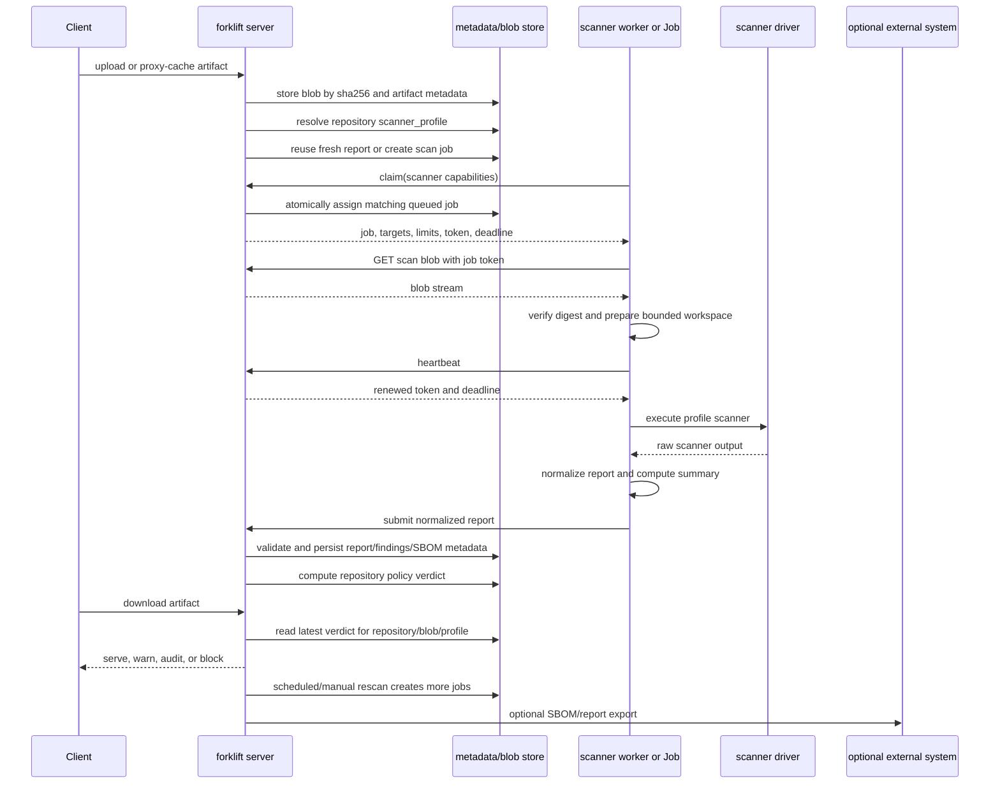

# Artifact Scanning Design Notes

## Status

Draft. This document records the current design direction for optional
artifact-level security scanning in forklift. It is intentionally not an
implementation plan yet.

## Context

forklift already has supply-chain controls that work at package-coordinate
level:

- OSV-based vulnerability policy
- deps.dev-based license policy
- age policy for fresh upstream versions
- package approval and version deny decisions

These controls are lightweight and fit forklift's core shape: a single Go
binary with embedded SQLite metadata, content-addressed blob storage, and
Kubernetes-native deployment.

Artifact Keeper shows a broader model: scanner orchestration, Trivy, Grype,
OpenSCAP, SBOM storage, Dependency-Track integration, scan policies, and
quarantine workflows. That model is powerful, but its own audit notes identify
SBOM/scanner integration as one of the largest defect areas. The lesson for
forklift is not "copy the stack"; it is to keep the integration boundary small,
make scanner state explicit, and add scanning only as an optional profile.
Its public scanning guide also highlights operational concerns that matter even
for a smaller implementation: scanner database freshness, scheduled rescans,
manual rescans, hash-based deduplication, scanner availability, and scan
performance metrics.

Harbor is also already used for Docker/OCI images in the target environment, so
forklift should not duplicate Harbor's image registry and image scanning role.

## Goals

- Add a path for artifact-level vulnerability scanning of Maven, npm, PyPI,
  Cargo, and Go artifacts.
- Keep scanning optional and disabled by default.
- Keep forklift's serving path fast: request handling must consult stored scan
  verdicts only, never run a scanner inline.
- Reuse scan results by blob SHA-256 so identical bytes are scanned once.
- Allow scanner workers to scale independently from the registry process.
- Preserve future extension points for SBOM storage and Dependency-Track export.
- Track scanner database freshness so operators can distinguish "clean with a
  current database" from "clean with stale vulnerability data."
- Support explicit and scheduled rescans without making them part of the first
  serving-path implementation.

## Non-Goals

- Do not make forklift an OCI image scanner. Harbor owns that surface.
- Do not embed scanner binaries in the forklift server image.
- Do not require Syft, Grype, Trivy, OpenSCAP, or Dependency-Track for normal
  operation.
- Do not add OpenSCAP as a default scanner. It is mainly useful for operating
  system, RPM/DEB, container image, and compliance profiles, not ordinary
  language package artifacts.
- Do not block unscanned artifacts by default during the initial rollout.
- Do not build a full SBOM management platform inside forklift.

## Proposed Architecture

Scanning should be split into two processes:

```text
forklift server
  - stores artifacts as content-addressed blobs
  - creates scan jobs
  - stores scan results and policy verdicts
  - serves package traffic
  - checks stored verdicts in policy gates

scanner worker
  - claims scan jobs
  - downloads or opens blobs by SHA-256
  - runs external scanner tools
  - normalizes results
  - posts results back to forklift
```

The initial scanner worker should be separate from the server binary. In
Kubernetes this can be a small Deployment enabled by the Helm chart:

```yaml
artifactScanning:
  enabled: false
  defaultProfile: grype-default
  profiles:
    grype-default:
      scanner: grype
      mode: deployment
      configHash: grype-default-v1
  worker:
    replicas: 1
  policy:
    scanner_profile: grype-default
    action: audit
    threshold: high
    block_unscanned: false
```

The worker security model, including disposable Job execution, short-lived scan
tokens, NetworkPolicy, and optional gVisor/Kata runtime isolation, is described
separately in [Artifact Scanner Worker Security Design](artifact-scanner-worker-security.md).

## End-to-End Flow

The full design is asynchronous. Package request handling never executes a
scanner. It writes artifacts, enqueues scan work, and later evaluates stored
verdicts.



The same blob may be reachable from multiple repositories or paths. The scanner
report is stored by blob identity, while the verdict is stored by repository
policy context:

```text
blob bytes -> one normalized scanner report
repository policy + report -> one repository-specific verdict
```

This lets forklift reuse expensive scanner work while still allowing each
repository to have different thresholds, actions, and scanner profiles.

### Write Path

1. A hosted upload or proxy cache write stores the artifact blob by
   `blob_sha256`.
2. The server resolves the repository's `scanner_profile`.
3. The server checks for a fresh reusable report for
   `blob_sha256 + scanner + scanner_config_hash + database_built_at`.
4. If a fresh report exists, the server recomputes the repository verdict from
   the current policy.
5. If no reusable report exists, the server creates an `artifact_scan_jobs`
   record.
6. The package write succeeds independently of scanner execution unless the
   repository has a strict pre-serve posture that blocks later downloads until a
   verdict exists.

### Worker Path

1. A Deployment worker polls with its capabilities, or the controller creates a
   one-shot Kubernetes Job from a scanner profile.
2. The server assigns only jobs whose scanner/profile can be executed by that
   worker.
3. The worker receives a short-lived job token, artifact targets, and resource
   limits.
4. The worker downloads exactly one blob through the internal scan API.
5. The worker verifies the blob digest and writes it into a bounded private
   workspace.
6. The worker heartbeats while scanning; each heartbeat extends the lease and
   renews the short-lived token.
7. The scanner driver runs the selected toolchain, for example Grype or
   Syft+Grype.
8. The worker normalizes raw scanner output into the shared result schema.
9. The server validates the result, rejects stale workers, stores report data,
   and computes verdicts.

### Read Path

1. A client requests an artifact download.
2. The server resolves the repository policy and scanner profile.
3. The server reads the latest verdict for the repository, blob, and profile.
4. If no verdict exists, `block_unscanned` decides whether to serve or block.
5. If a verdict exists, the policy action decides whether to audit, warn, or
   block.
6. The server may enqueue or keep scan work in the background, but never runs a
   scanner in the download request.

### Rescan Path

Manual, scan-all, and scheduled rescan use the same job model:

```text
manual rescan      -> selected artifact/blob
repository scanall -> all artifacts in one repository
global scanall     -> all stale or selected artifacts
scheduled rescan   -> stale report age or scanner DB freshness policy
```

Rescan can either force a new report or reuse existing fresh reports and only
recompute verdicts. Operator-triggered scan-all should be rate-limited and
audited.

### Operator API Surface

The public API should expose scanner state without exposing scanner internals:

```http
GET  /api/v1/repositories/{id}/artifacts
GET  /api/v1/repositories/{id}/artifacts/scan?path=
GET  /api/v1/repositories/{id}/artifacts/sbom?path=
POST /api/v1/repositories/{id}/artifacts/scan?path=
POST /api/v1/repositories/{id}/artifacts/scan-batch
POST /api/v1/artifact-scans/scan-all
POST /api/v1/artifact-scans/verdicts/recompute
POST /api/v1/artifact-scans/sboms/export
```

Expected behavior:

- artifact scan detail returns job, report, verdict, findings, and optional SBOM
  metadata.
- manual artifact scan creates one job for the repository's resolved profile.
- repository scan-all creates bounded jobs for repository artifacts.
- global scan-all creates bounded jobs across repositories with artifact
  scanning enabled.
- verdict recompute never runs scanners; it only reapplies repository policy to
  existing reports.
- SBOM export records destination/status separately from scan report status.

### Failure Path

The system is at-least-once. A job may be retried, but only the winning lease can
submit a result.

- Worker crash: lease expires and another worker can reclaim the job.
- Repeated expiry: job becomes `dead` after max attempts.
- Oversized artifact: worker submits `skipped_too_large`.
- Scanner cannot apply: worker submits `not_applicable`.
- Scanner execution error: worker submits `failed`.
- Stale worker result after lease loss: server returns conflict and ignores it.
- Policy change: server recomputes verdicts without rescanning bytes.

## Scanner Selection

Scanner integration should be abstracted from the start. Grype is the first
bundled implementation, not the architecture boundary.

The stable boundary is:

```text
scanner profile
  -> worker execution mode
  -> scanner driver
  -> normalized scan report
  -> repository policy verdict
```

The server owns scanner profiles and policy decisions. The worker owns scanner
execution. A scanner driver owns one scanner tool's command line, metadata, and
normalization logic.

Recommended interface shape:

```text
ScannerDriver
  Name() string
  Capability(ctx) ScannerCapability
  Scan(ctx, prepared_artifact, profile) NormalizedReport

ScannerCapability
  name
  version
  supported_ecosystems
  supported_artifact_types
  supports_sbom
  database_schema_version
  database_built_at
```

Workers should advertise their scanner names/capabilities when claiming work.
The server must only assign a job to a worker that can execute that scanner
profile. This avoids a multi-scanner deployment where a Grype-only worker claims
a future Trivy/Syft-only job and fails after downloading untrusted bytes.

Scanner profiles are deployment policy, not raw scanner names:

```yaml
artifact_scan:
  enabled: true
  scanner_profile: grype-default
  action: audit
  threshold: high
```

Example profiles:

```yaml
scannerProfiles:
  grype-default:
    scanner: grype
    mode: deployment
    configHash: grype-default-v1
    maxArtifactBytes: 104857600

  grype-gvisor-job:
    scanner: grype
    mode: job
    runtimeClassName: gvisor
    configHash: grype-gvisor-v1
    maxArtifactBytes: 104857600

  syft-grype-sbom:
    scanner: syft-grype
    mode: job
    storeSBOM: true
    configHash: syft-grype-v1
```

Repository policy should reference `scanner_profile` only. Do not keep
repository-facing `scanner` and `config_hash` knobs for compatibility. The
profile resolves to a scanner name plus execution and safety settings. The
result dedup key still uses the resolved scanner identity and config hash so
profile changes are explicit.

## Harbor Advantages To Adopt

Harbor's OCI-specific model should not be copied directly, but its scanner
orchestration strengths should be adopted completely:

- Pluggable scanner boundary: Grype is one implementation behind a stable
  scanner driver/adapter contract.
- Capability discovery: workers report scanner version, supported ecosystems,
  SBOM support, and database freshness before receiving work.
- Profile selection: repository policy chooses a scanner profile; operators can
  run different profiles for ordinary, high-risk, and SBOM-export repositories.
- Async scan lifecycle: request handling enqueues or reads stored verdicts; it
  never runs a scanner inline.
- Job/report separation: execution jobs, normalized scanner reports, and
  repository policy verdicts are separate records.
- Manual scan, scan-all, and scheduled scan: operators can rescan one artifact,
  one repository, or all stale results after scanner DB updates.
- Stored-report policy gate: pull/download decisions use stored reports and
  verdicts, not live scanner calls.
- Scanner health/freshness visibility: UI/API shows scanner availability,
  scanner DB age, report age, and stale verdict reasons.
- Metrics and audit events: scans, failures, duration, queue depth, stale DB,
  policy blocks, and manual rescans are observable.
- External integration path: SBOM export and Dependency-Track stay optional but
  use stored SBOM/report records instead of ad hoc scanner output.

The result is Harbor's operational model applied to Maven/npm/PyPI/Cargo/Go
artifacts, not an OCI registry clone.

The first useful bundled scanner to evaluate is Grype.

Rationale:

- It can scan directories, archives, filesystems, SBOMs, and container
  references.
- It is directly relevant to package artifacts.
- It is lighter than adopting a full Trivy + Grype + OpenSCAP + Dependency-Track
  stack.
- It can be introduced without committing to SBOM persistence.

Syft is a later extension when SBOMs are a product requirement:

```text
artifact -> Syft -> SBOM stored by blob SHA-256
SBOM     -> Grype -> vulnerability findings
```

Do not expose scanner-specific result JSON directly to policy or UI code. Every
scanner must normalize into the same `artifactscan.Result` shape first.

Dependency-Track is a later external integration, not a core dependency:

```text
stored SBOM -> Dependency-Track upload -> long-term portfolio tracking
```

Grant can be considered only if license enforcement needs to move from
deps.dev coordinate checks to SBOM-based license compliance. It is not part of
the first design slice.

## Data Model Direction

The model should separate profiles, jobs, scan reports, policy verdicts,
findings, and optional SBOMs.

```text
artifact_scanner_profiles
  name
  scanner
  mode                deployment | job
  config_hash
  runtime_class_name
  max_artifact_bytes
  max_extracted_bytes
  max_files
  store_sbom
  created_at
  updated_at

artifact_scanner_capabilities
  scanner
  worker_id
  version
  database_schema_version
  database_built_at
  supported_ecosystems_json
  supports_sbom
  reported_at

artifact_scan_jobs
  id
  blob_sha256
  scanner
  scanner_profile
  scanner_config_hash
  status              queued | running | completed | failed | not_applicable
                      | skipped_too_large | dead | reused
  worker_id
  attempts
  lease_until
  last_heartbeat_at
  next_run_at
  error
  created_at
  started_at
  finished_at

artifact_scan_results
  id
  job_id
  blob_sha256
  scanner
  scanner_version
  scanner_config_hash
  database_schema_version
  database_built_at
  database_providers_json
  status              completed | failed | not_applicable | reused
                      | skipped_too_large
  max_severity
  finding_count
  raw_result_digest
  error
  scanned_at
  source_result_id    nullable, for reused results

artifact_scan_verdicts
  id
  repository_id
  blob_sha256
  result_id
  scanner_profile
  policy_hash
  action              allow | audit | warn | block | pending
  reason
  max_severity
  computed_at

artifact_scan_findings
  id
  result_id
  vuln_id
  severity
  package_name
  package_version
  fixed_version
  source
  source_url

artifact_sboms
  id
  blob_sha256
  result_id
  format              cyclonedx | spdx
  generator
  generator_version
  content_digest
  content_json
  created_at
```

`artifact_scan_results` are scanner facts. `artifact_scan_verdicts` are
repository-policy decisions. Changing a repository threshold or action should
recompute verdicts without rescanning bytes.

The `not_applicable` state is important. A scanner that does not apply to an
artifact must not produce a clean result. It also should not be treated as a
scanner crash. Those are different operational states.

Findings and SBOM inventory should not be conflated. A vulnerability finding is
evidence of a problem. An SBOM component inventory is evidence of what was
observed, including packages with no known vulnerabilities.

## Deduplication

Scan deduplication should be based on blob identity:

```text
blob_sha256 + scanner + scanner_config_hash + database_built_at
```

If scanner configuration affects output, it must change `scanner_config_hash`.
Repository policy does not belong in the scan-result dedup key because policy is
applied after scanning in the verdict layer.

Deduplication should support two paths:

- Reuse a completed result for identical bytes.
- Force a rescan when an operator suspects the previous scan was incomplete,
  stale, or produced with a broken scanner version.
- Recompute verdicts when policy changes without creating a scanner job.

Clean results are only meaningful relative to scanner database freshness. A
future implementation should invalidate or age out reusable scan results when
the scanner database changes enough to make a rescan valuable. The first slice
can expose database freshness as metadata and leave automatic invalidation for a
later phase.

## Policy Model

Repository policy should start audit-only:

```yaml
artifact_scan:
  enabled: true
  scanner_profile: grype-default
  action: audit       # audit | warn | block
  threshold: high     # critical | high | medium | low
  block_unscanned: false
```

Serving behavior:

- If scanning is disabled, serve normally.
- If no verdict exists and `block_unscanned=false`, serve and enqueue/keep the
  job.
- If no verdict exists and `block_unscanned=true`, block only for repositories
  that explicitly opt into that strict posture.
- If the latest applicable verdict exceeds the threshold, apply `audit`, `warn`,
  or `block`.
- `failed` and `not_applicable` must be configurable separately. A scanner crash
  is not the same as a scanner not applying to a package.
- If repository policy changes, recompute verdicts from existing reports before
  creating new scan jobs.

## Trigger Points

Scan jobs can be created after:

- hosted upload
- proxy cache write
- explicit admin rescan request
- scheduled rescan for stale or high-value artifacts

The initial implementation should not scan during a client download request.
For proxy repositories, cache-write-time enqueue is enough for the first slice.

Scheduled rescan should be bounded. Useful knobs:

- maximum artifact age to rescan
- maximum jobs per interval
- low-priority queue mode
- force rescan vs reuse-if-fresh

## Artifact Keeper Lessons To Preserve

The Artifact Keeper design and audit history point to several guardrails:

- Scanner applicability must be decided before recording a clean result.
- Failed scanner execution, non-applicable scanner, and clean scan are distinct
  states.
- Scan result reuse needs concurrency protection. Duplicate running scans for
  the same artifact and scanner are easy to create without an atomic placeholder
  step.
- Inventory/SBOM persistence can fail after findings were persisted. That needs
  a visible degraded state if SBOMs are introduced.
- Dependency-Track should remain optional because it is operationally heavy.
- OpenSCAP should remain specialized, not a default package scanner.
- Scanner database freshness and scan cache freshness are separate concepts.
  Both need visibility before enforcement becomes trustworthy.

## Rollout Plan

### Phase 0: Design and API Shape

- Add no scanner binaries.
- Define scanner profile, worker capability, job, report, verdict, SBOM, and
  external export API contracts.
- Decide whether scan results are stored by `blob_sha256` only or also linked
  directly to each artifact row for faster UI queries.
- Define metrics and audit events.
- Define scanner database freshness fields and API shape.

### Phase 1: Scanner Abstraction and Grype Audit Worker

- Add profile-based scanner selection.
- Add worker capability advertisement and scanner-aware claim matching.
- Add an optional worker driver that runs Grype against stored blobs.
- Store normalized vulnerability findings by `blob_sha256`.
- Show scan status and max severity in the API/UI.
- Keep repository policy in `audit`.
- Keep `block_unscanned=false`.

### Phase 2: Policy Enforcement

- Add `warn` and `block` modes.
- Add manual rescan.
- Add repository scan-all and global scan-all APIs.
- Add stale-result handling.
- Add per-repository threshold configuration.
- Add basic scanner availability and database freshness checks.
- Add verdict recomputation without rescanning when repository policy changes.

### Phase 3: Optional SBOM

- Add Syft-based SBOM generation behind scanner profiles.
- Store SBOMs by `blob_sha256`.
- Keep findings and SBOM component inventory separate.
- Add scheduled rescan once clean-result freshness is visible and tested.

### Phase 4: External Integrations

- Add Dependency-Track export for stored SBOMs.
- Add Grant only if license compliance needs SBOM-level evaluation.
- Keep export status and errors separate from scan result status.

## Open Questions

- Should scan jobs live in SQLite, or should the worker poll an API that hides
  the queue implementation?
- Should the worker read blobs through the public package API, an internal API,
  or direct storage access?
- How long should a clean scan remain reusable before requiring a rescan?
- How should group repositories present scan status when the same blob is
  reachable through several repository names?
- What is the smallest UI surface: status badge only, or a findings table in
  the artifact detail view?
- Should manual and bulk scan APIs return job IDs, scan result IDs, or both?
- Should scheduled rescans be repository-scoped, global, or driven by scan
  result age and severity?

## Current Recommendation

Adopt Harbor's scanner orchestration strengths, but bind them to forklift's
language package artifact model. The stable target is profile-based scanner
selection, capability-aware worker assignment, normalized reports, stored SBOMs
when enabled, recomputable verdicts, scheduled/manual rescans, scan-all
operations, metrics/audit, and optional external export.

Keep Harbor responsible for container images. forklift should own Maven, npm,
PyPI, Cargo, and Go package artifacts.

## Implementation Strategy

The current artifact-scan branch should be treated as a prototype, not as a
compatibility contract. The feature has not been merged or released, so the
implementation should be reset to the final model instead of carrying legacy
translation layers.

Do not preserve compatibility for:

- repository policy fields `scanner` and `config_hash`;
- worker claim requests that omit capabilities;
- flat artifact-list scan fields that mix job, report, and verdict state;
- a single global scanner setting in Helm values;
- shared job/result/verdict status vocabulary;
- result-as-policy-gate shortcuts.

The implementation should converge directly on:

```text
repository policy -> scanner_profile
scanner_profile   -> resolved scanner, execution mode, limits, config hash
worker claim      -> required capability report
scan job          -> execution lease for one blob/profile
scan report       -> normalized scanner facts for one blob/config/database
scan verdict      -> repository policy decision derived from a report
```

Code that remains useful from the prototype can be reused only if it fits this
model cleanly:

- Grype JSON normalization and tests;
- short-lived token signing;
- lease and heartbeat concepts;
- bounded worker workspace preparation;
- blob-SHA based report reuse;
- UI ideas for displaying status and findings.

Everything else should be rewritten rather than adapted through compatibility
branches.

Recommended implementation order:

1. Replace repository config with `artifact_scan.scanner_profile`.
2. Rewrite the artifact scan migration around profiles, capabilities, jobs,
   reports, verdicts, findings, SBOMs, and export state.
3. Rebuild `internal/artifactscan` around explicit `Profile`, `Capability`,
   `Job`, `Report`, `Verdict`, and `SBOM` types.
4. Rebuild meta-store methods around the new state machine.
5. Rebuild the internal worker API:
   - claim requires capabilities;
   - claim assigns only matching profile/scanner jobs;
   - heartbeat renews lease and job token;
   - result submission stores a report and recomputes verdicts.
6. Rewire repository write paths to resolve profiles, reuse fresh reports, or
   enqueue scan jobs.
7. Rewire repository read paths to consult verdicts only.
8. Add manual rescan, repository scan-all, global scan-all, and verdict
   recompute APIs.
9. Regenerate OpenAPI and update the UI around nested `artifact_scan` detail
   rather than flat fields.
10. Replace Helm values with profile-based configuration.
11. Add Job mode, RuntimeClass profiles, SBOM profiles, and external export.

Current branch implementation status:

- Steps 1 through 7 are implemented in the core model, store, worker API, and
  repository read/write paths.
- Step 8 is implemented for manual scan, batch scan, repository/global
  scan-all, and verdict recompute. The current scan-all API is bounded by
  request `limit`; cluster-wide rate limiting can be layered on the same route.
- Step 9 is implemented for the OpenAPI schema and TypeScript API client. The UI
  still shows artifact scan fields in the repository artifact views rather than
  a dedicated global scanner console.
- Step 10 is implemented for the default profile, worker token, max attempts,
  max artifact size, SBOM storage, worker mode, and RuntimeClass Helm values.
- Step 11 is implemented as Deployment workers plus CronJob-backed one-shot Job
  workers. RuntimeClass is applied to both worker modes. SBOM storage uses Syft
  through the scanner worker when profile `store_sbom` is enabled. External
  export currently records pending export state for stored SBOMs; adding a
  destination-specific uploader is a follow-up adapter, not part of scan result
  persistence.

Suggested PR sequence:

```text
PR 1: docs, config shape, model types, and schema reset
PR 2: meta store, service layer, and internal worker API
PR 3: worker capability/profile support and Grype driver
PR 4: repository enqueue, report reuse, verdict gate, and recompute
PR 5: public API, OpenAPI, and UI
PR 6: Helm profile values and deployment templates
PR 7: Job mode and RuntimeClass hardening
PR 8: SBOM profile and Dependency-Track/export plumbing
```

The first useful milestone is PR 1 through PR 4. At that point forklift has the
Harbor-style core: scanner profiles, capability-aware workers, asynchronous
jobs, normalized reports, and stored verdict-based policy gates.
