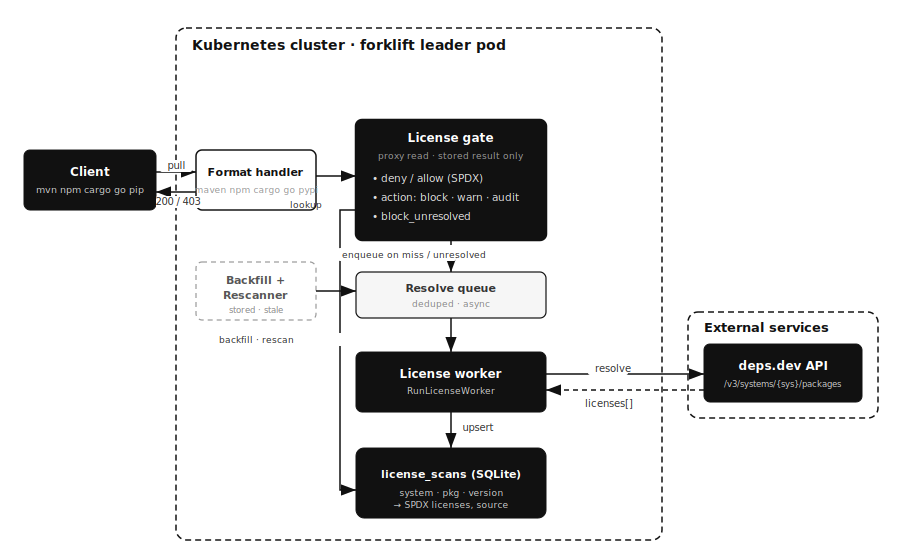

# License scanning

## Overview

This document explains forklift's license scanning: how it resolves the
declared license of each package version, how the per-repository license policy
gates serving, and how to operate it in production.

Read this if you run forklift and need to know what licenses your developers are
pulling through proxy repositories, or you must enforce a license rule (for
example, block `GPL-3.0`, or allow only a vetted set of permissive licenses).

License scanning sits alongside the existing supply-chain controls — the age
policy, package approval, version denies, and vulnerability scanning — and is
configured per repository the same way.

## Architecture



Two paths run independently:

- **Serving path (synchronous).** A client pull reaches the format handler,
  which calls the **license gate** before serving. The gate reads only the
  *stored* resolution from `license_scans` — it never blocks on a live network
  lookup. It decides serve / block based on the repository's policy.
- **Resolution path (asynchronous).** When the gate finds no stored result it
  enqueues the coordinate on the **resolve queue** (deduplicated). The
  **license worker** drains the queue, calls **deps.dev**, and upserts the SPDX
  licenses into `license_scans`. A **backfill** sweep enqueues already-stored
  artifacts that have never been resolved, and a **rescanner** re-enqueues
  results older than the configured TTL so license changes surface.

Resolution is keyed by `(system, package, version)`, so a package shared by
several proxy repositories is resolved once and reused everywhere.

## Data source

Licenses come from the [deps.dev](https://deps.dev) API, which exposes
per-version license metadata for every package system forklift proxies behind
one schema. forklift queries:

```
GET {FORKLIFT_DEPSDEV_URL}/v3/systems/{system}/packages/{package}/versions/{version}
```

and reads the `licenses` array (SPDX expressions). The coordinate for each
format:

| Format | deps.dev system | Package coordinate | Example |
|--------|-----------------|--------------------|---------|
| Maven  | `maven`         | `group:artifact`   | `com.google.guava:guava` |
| npm    | `npm`           | package name       | `lodash`, `@scope/pkg` |
| Cargo  | `cargo`         | crate name         | `serde` |
| Go     | `go`            | module path        | `github.com/pkg/errors` |
| PyPI   | `pypi`          | normalized name    | `requests` |

The result is whatever deps.dev reports — an SPDX identifier such as `MIT`, an
expression such as `(MIT OR Apache-2.0)`, or empty when the source has no
license on record. forklift does not parse package archives or POM/`package.json`
files itself.

## Enabling resolution

License resolution is a process-wide switch, controlled by environment
variables. It is **on by default** (the default deps.dev endpoint is set); set
`FORKLIFT_DEPSDEV_URL` to empty to disable resolution and the gate entirely.

| Variable | Default | Meaning |
|----------|---------|---------|
| `FORKLIFT_DEPSDEV_URL` | `https://api.deps.dev` | deps.dev API base. Empty disables license scanning. |
| `FORKLIFT_LICENSE_RESCAN_INTERVAL` | `24h` | How often the backfill sweep runs and how often stale results are re-checked. |
| `FORKLIFT_LICENSE_TTL` | `7d` | A stored result older than this is eligible for re-resolution. |

The worker, backfill, and rescanner are **leader-gated**: in an HA deployment
only the leader drives them, keeping a single writer to SQLite.

Resolution running does not change serving on its own — it only populates
`license_scans`. Serving is affected only when a repository turns on a policy.

## Per-repository policy

The license policy is part of a repository's config and applies to **proxy**
repositories only (hosted uploads are resolved for display but not gated). Set
it in the UI under a repository's **License policy** panel, or in the config
JSON:

```json
{
  "license": {
    "enabled": true,
    "action": "block",
    "deny": ["GPL-3.0", "AGPL-3.0"],
    "allow": ["MIT", "Apache-2.0", "BSD-3-Clause"],
    "block_unresolved": false
  }
}
```

| Field | Meaning |
|-------|---------|
| `enabled` | Turns the gate on for this repository. |
| `action` | `block` (refuse to serve, HTTP 403), `warn`, or `audit` (both serve but log and count). Default `audit`. |
| `deny` | SPDX ids that are never allowed. A version carrying any of these is gated. |
| `allow` | When non-empty, switches to allow-list mode: a version carrying any license *outside* this list is gated. Empty means "allow everything except `deny`". |
| `block_unresolved` | With `action=block`, gate a version that has not been resolved yet (enforce posture). Otherwise unresolved versions are served and resolved in the background. |

### How a request is evaluated

1. If the gate is disabled, the format is unsupported, or there is no resolver,
   serve normally.
2. Look up the stored result for the exact `(system, package, version)`.
   - **Not resolved yet:** enqueue a resolution. Block with 403 only if
     `action=block` **and** `block_unresolved` is set; otherwise serve.
   - **Resolved:** evaluate the licenses:
     - any license in `deny` → violation;
     - `allow` non-empty and any license outside it → violation;
     - no resolved license → never a violation here (the unresolved rule above
       governs the unknown case).
3. On a violation, apply `action`: `block` returns 403 and records a
   `license.block` audit event; `warn`/`audit` serve the request and log a
   "would block" line.

License id matching is **case-insensitive** (`gpl-3.0` matches `GPL-3.0`).

> The match is on the directly requested coordinate only. Transitive
> dependencies and artifact integrity are out of scope, and the SPDX value is
> exactly what deps.dev reports — treat an empty or unexpected license as
> "unknown", not "permissive".

## Visibility

- **UI.** A repository's artifact browser shows a **License** column with an
  SPDX badge per version, next to the vulnerability column.
- **API.** `GET /api/v1/repositories/{id}/artifacts` includes `licenses`,
  `license_source`, and `license_resolved_at` on each artifact.
- **Audit log.** A block in `block` mode records a `license.block` event with
  the repository, `package@version`, user, and client IP.

## Metrics

Two Prometheus counters, documented in [metrics.md](metrics.md):

- `forklift_license_blocked_total{repo, action}` — requests gated by the policy
  (blocked or recorded-only by action).
- `forklift_license_resolves_total{result}` — background resolutions by result
  (`resolved`, `unknown`, `error`).

A practical rollout sequence:

1. Enable the policy with `action=audit` and your intended `deny`/`allow`.
2. Watch `rate(forklift_license_blocked_total{repo="..."}[1h])` and the
   "would block" log lines to see what `block` *would* refuse.
3. Once the false-positive rate is acceptable, switch `action` to `block`.

## Operations and troubleshooting

- **Licenses are missing in the UI.** Resolution is asynchronous: a
  freshly-cached version may show no license until the worker processes it. The
  backfill also fills in older artifacts on its interval. Confirm
  `FORKLIFT_DEPSDEV_URL` is set and reachable from the pod.
- **`forklift_license_resolves_total{result="error"}` is climbing.** deps.dev
  lookups are failing (network egress blocked, rate limited, or the endpoint is
  wrong). Unresolved coordinates fail open unless `block_unresolved` is set, so
  serving is unaffected, but license data goes stale.
- **A version is blocked that should not be.** Check the resolved value in the
  artifact browser or via the API. deps.dev may report an expression
  (`(MIT OR GPL-3.0)`) or an unexpected id; adjust `deny`/`allow` accordingly,
  or temporarily move the license to `allow`.
- **Air-gapped / no egress.** Set `FORKLIFT_DEPSDEV_URL` to empty to disable the
  feature, or point it at an internal mirror of the deps.dev API.

## Conclusion

License scanning resolves each proxied version's SPDX license from deps.dev in
the background, stores it per coordinate, and lets each proxy repository gate
serving with a deny/allow policy and a block/warn/audit action — mirroring the
vulnerability policy. Start in `audit`, watch the metrics, then enforce.
